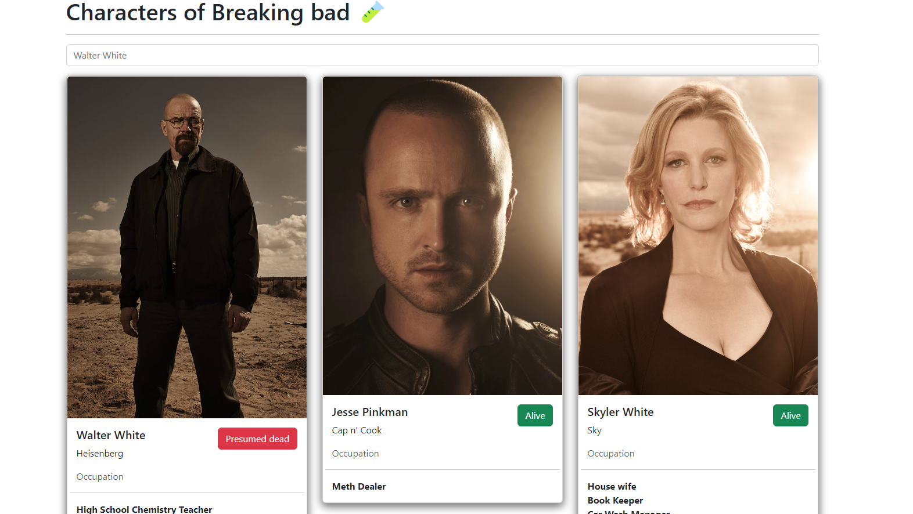

# Getting Started with Create React App

Used api Breaking Bad : `https://breakingbadapi.com/api/characters`

Used Bootstrap to styles: `https://getbootstrap.com/`

Deployed in vercel 😍

--- 
# Application preview 👀🧪👨‍💻

    

---
## Available Scripts

In the project directory, you can run:

👀👀 BEFORE CLONE IT REMEMBER :

`npm i`

&& after 🧪
### `npm start`

Runs the app in the development mode.\
Open [http://localhost:3000](http://localhost:3000) to view it in your browser.

The page will reload when you make changes.\
You may also see any lint errors in the console.

